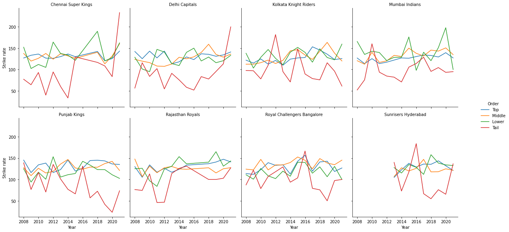
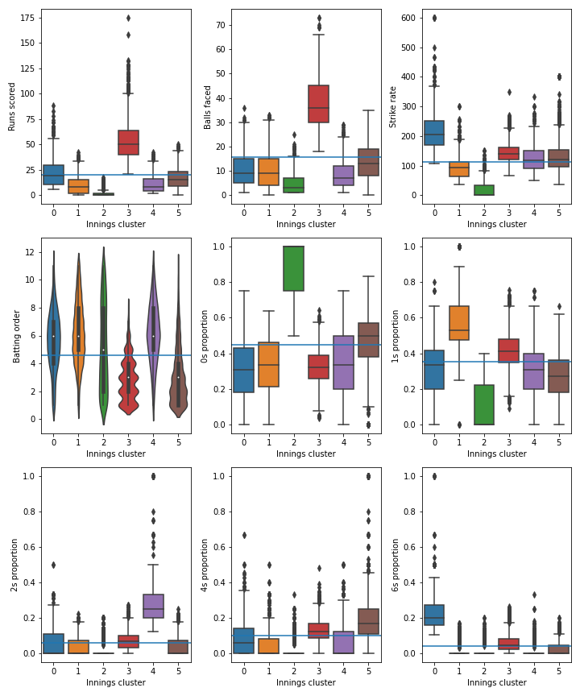
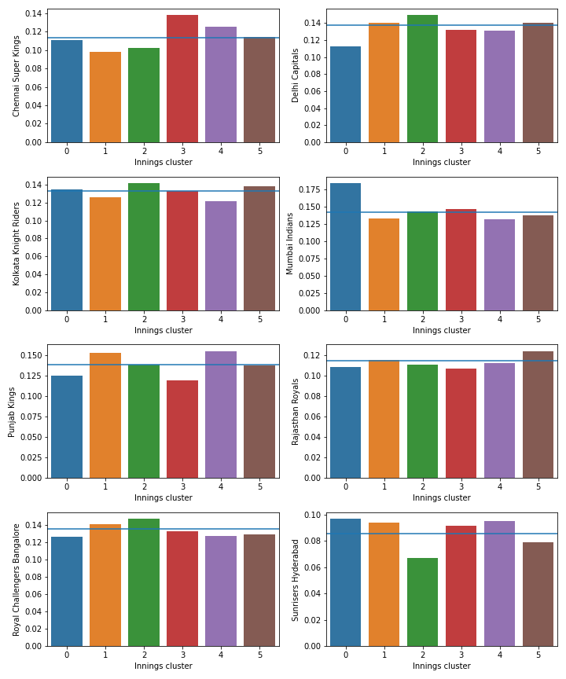
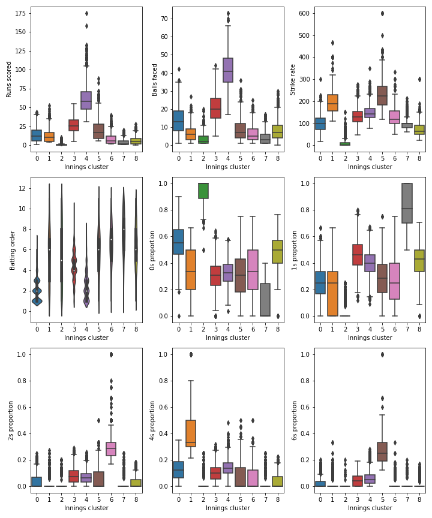
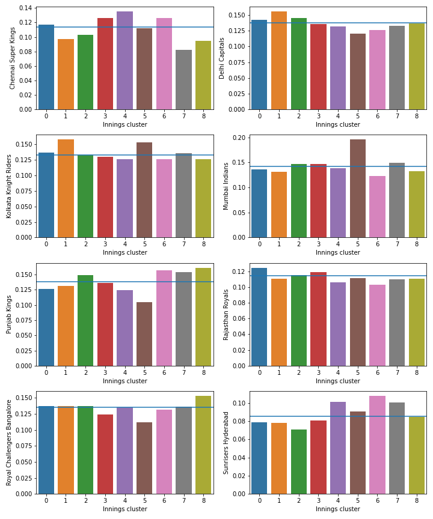
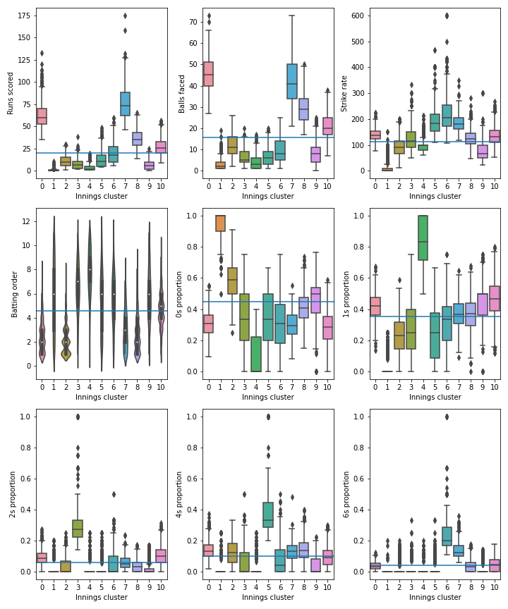
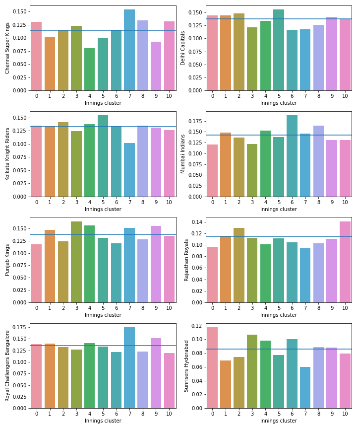

## Background and Project Aim
The bat and ball game of cricket is widely considered to have originated in England in the 16th century and as a result of the British empire has since become one of the most played and watched sports in the world. According to the International Cricket Council (2018), there are over 1 billion cricket supporters worldwide and nearly 90% of them come from the Indian subcontinent. It is the most popular sport in Pakistan, Bangladesh, Sri Lanka, Afghanistan and India with support for the game is particularly fervent in the latter.

Twenty20 (T20) cricket is a form of the game that was first played professionally in 2003, when the England and Wales Cricket Board (ECB) introduced the Twenty20 Cup to the domestic schedule, to be played by the 18 First Class counties. T20 is a shortened form of the game where two teams of 11 players play one innings each. One teams bowls 20 overs, each consisting of 6 deliveries, at the other team and the aim is to score more runs than the other team. Two members of the batting team are batting at any one time and runs are scored by both running from one end of the wicket, a 22 yard by 10 foot strip of grass in the middle of the pitch, to the other, or when the ball crosses the boundary of the pitch either after hitting the ground (4 runs) or without hitting the ground after making contact with the bat (6 runs). The bowling team attempt to prevent the batting team from scoring runs and also attempt to get the batters out (take wickets), principally by bowling the ball at the stumps, two sets of three wooden poles at each end of the wicket, catching the ball off the bat before it bounces or hitting the stumps with the ball while the batters are in the process of completing a run. Since two batters have to be in at a time, when a team loses its 10th wicket the innings is completed.

In 2007 India beat their biggest rivals, Pakistan, in the final of the inaugural Twenty20 World Cup. Prior to this, Indian supporters had been sceptical of the newest format of the game, but the international team’s success led to a burgeoning interest and the advent of the Indian Premier League (IPL), which was announced by the Board of Control for Cricket in India (BCCI) in September 2007 and would start in 2008. The inaugural edition consisted of 8 teams belonging to franchises that were sold for an initial $723.59m (https://www.espncricinfo.com/story/ipl-announces-franchise-owners-333193) playing a round robin, followed by semi-finals and a final. The format has varied slightly from 2008 to the present day, but has always been contested by 8, 9 or 10 franchise teams. The sum of money paid for the franchises before the 2008 tournament is a reflection of the status of the owners of the franchises, including Bollywood stars and multinational conglomerates. The wealth of the franchise owners meant they were able to entice many of the world’s best cricketers to play in the IPL and this, along with the marketability of and excitement provided by the short format of the game has led to it being one of the most popular sporting events in the world.

Some sports, like football, are continuous in nature and can be difficult to analyse statistically. However, cricket is a sport that consists of a number of discrete events (balls, or deliveries), the outcome of which can be measured in terms of the number of runs and wickets (0 or 1) that result from it. Such ball-by-ball data is widely available on the internet and can be used to gain insights into the game (Player evaluation in Twenty20 cricket, Davis, Perera & Swartz, 2015). More complex data has also been collected in recent years, including ball tracking data that can illustrate where the ball was released from, where it hit the ground, how fast it was travelling and where it passed the batter and the stumps. This revolution in data collection has enriched the simple ball-by-ball data, but is not publicly available due to the costs associated with collecting it.

Baseball is another game that consists of a number of discrete events and, although the two are very different tactically, can be used as a blueprint for the use of data analysis in cricket. Sabermetrics is a term invented by Bill James and encompasses the statistical analysis of statistics in baseball in an attempt to empirically compare the performance of different baseball players. Sabermetrics was brought to public attention by the book Moneyball, published in 2003, which chronicles the statistical approach of the Oakland Athletics’ player recruitment and how it enabled them to reach the 2002 Major League Baseball playoffs despite having the third lowest team salary in the competition. While complex data analysis has been used successfully in baseball for nearly two decades, only recently have professional cricket teams started enlisting the help of individuals with expertise in data analysis and data science. Companies like CricViz, founded in 2014, have brought analytics to the fore in cricket, working with teams in the IPL, Australia’s Big Bash League and the Pakistan Super League to improve results on the pitch, as well as with broadcasters and media organisations including Sky Sports and The Telegraph to improve the understanding of the cricket following public.

The aims of this research are to use data mining techniques to evaluate batting tactics and strategies in the IPL. We aim to investigate how they have changed over time and how they differ between teams and players. For example, it could be that some teams look to attack throughout the 20 overs and accept the higher risk of losing wickets that goes along with that, whereas others may look to accumulate and keep wickets in hand for the final (“death”) overs, when they will look to score very quickly. According to Nathan Leamon, the England cricket team’s Lead Analyst and co-founder of CricViz, the role of analysis in cricket is to provide a clearer view for captains, coaches and players and to reveal patterns that are not otherwise apparent (Sky Sports interview). Given the number of matches each team in the IPL play, understanding the tactics and strategies of opposition teams is not straightforward without detailed analysis and as a result this could provide useful insight for the aforementioned captains, coaches and players.

## Literature Review
The relationship between cricket and academic statistics dates back over two decades, and perhaps the most famous example is the Duckworth-Lewis method (Duckworth & Lewis, 1998). Cricket is a game that is frequently interrupted by adverse weather conditions and the Duckworth-Lewis method (now Duckworth-Lewis-Stern), first used in international cricket in 1997, was designed to set revised run targets in the second innings of limited overs matches that had been interrupted, in a fairer way than this had previously been done. 

More recently, with the advent of more advanced techniques and programs, there has been a concerted effort not just within Cricket but all competitive team sports to make use of the vast amounts of data available on the internet. Despite this increased effort in recent years, literature searching relating to grouping players or teams directly has brought back few research projects. Whilst the majority of these articles found look to predict the outcome of a specific league and season or even individual matches.

Prakash et al. (2017) have made various efforts to produce an automated selection of a playing lineup for the IPL league, using various bowling and batting metrics that are common in cricketing statistical analysis, ending up with an 11 man team incorporating an even balance of various different playing styles commonly found in cricket. Kapadia et al. (2019) looked at using historic IPL data, much like the analysis you will see in the following paper, however with an aim to predict match outcomes and scores. A varied suite of machine learning techniques was undertaken to achieve this found that Random Forest performed the best over probablistic models however none of the techniques used produced an accurate enough model. This is typical of sports-focused predictive projects since there are so many uncontrollable variables at play.

Kampakis and Thomas (2015) approached with a seemingly monetary motivation, used key cricketing indexes such as Strike/Economy/Average rates of individual players to produce Naive Bayes and Random Forest models based upon rank based Pearson Correlation Coefficient scores. The results actually produced a more sensitive model when compared to the most popular gambling models, in predicting individual games. Caveated of course with a statement explaining "the overall level of accuracy is lower than that observed in many other sports" (Kampakis and Thomas, 2005). 

Returning to Prakash et al. (2007) there research revolves around outputting an even mix of various cricket roles such as openers, middles, finishers, pace bowlers, spinners and team roles such as captains. Clustering using K-means and evaulating number of clusters using the Elbow method, found 6 and 7 clusters of varying sizes for batsmen and bowlers, respectively. ReliefF algorithm was then taken to determine weighting of each feature within a cluster, with an aim of evaluating the key cricketing metric Most Valuable Player Index (MVPI), which is used both for batters and bowling and is calculated using the below functions:

> Batting = (Player's Batting Average / Tournament Batting Average ) * Runs Scored + (Player's Batting Strike Rate / Tournament Batting Strike Rate) ^2 * Runs Scored by the Player

> Bowling = (Tournament Bowling Average / Player's Bowling Average) + (Tournament Economy Rate / Player's Economy Rate ) * 2 * Wickets Taken By the Player

ReliefF works iteratively, taken a random vector (X) in turn and normalising feature values within each X, this is then compared to those in same classes with the weighting being reduced if it is further in space from a shared feature. Each cluster corresponds to a specific type of player, distinct for batsmen and bowlers and according to strict IPL team roster rules (see below), a player in a specific cluster would get preference in order of selection within a team. 

- There cannot be more than 4 foreign players in the playing eleven.
- There must be one captain and one wicketkeeper in the playing eleven. 
- There must be 2 openers, 3 middle order batsmen and 2 all-rounders. 
- There must be at least one uncapped (Player who hasn't played for the country ) Indian player.

Using the results of the cluster analysis, a novel Cluster Based Index (CBI) is defined by Prakash et al. to calculate the actual ranks of a player within a cluster using feature value and feature weights calculated earlier. Using iterative choice, the 8 IPL teams were then scored according to correct choices of individual players. The outcome showed that 73.33% of matches the prediction made corresponded to correctly chosen players. However since T20 is known to be quite eratic and hard to predict the overall sentiment is that of positivity it seems. A more rounded research would have not only separated bowlers and batsmen but taken in all-rounders which would possibly be ignored as their influence in a game might not be as profound as a player skilled in one or another part of the game. There are uncontrollable factors such as injury whereby the results may have been skewed in one direction, however a deep learning approach using more features and not reduced to the MVPI metric would have been interesting to see. Prakash et al. does mention an approach whereby a Genetic Algorithm approach be used in tandem for team selection, this would look to overcome problems relating to these aforementioned uncontrollable factors. Non-playing factors are also glazed over here, much like over team prediction models, in contrast to sabermetrics approaches in Baseball whose feature repertoire is significantly wider and selection is more robust. These other, often ignored factors such as salary have a key impact on a team's ability to change their lineup at will.

Despite these drawbacks, the model described here can be seen as a step toward greater possibility of teams to incorporate a more data based decision making when it comes to signing/releasing players. Despite statistical-based team selection techniques not being a new concept within competitive sports, there still remains a lot of work to be done in the field especially a highly volatile sport as Cricket.

## Business Understanding and Data Understanding
As has been discussed, cricket is a complex sport with an incredibly high ceiling not only for skill within the game itself but the statistical analysis possible from a even single ball, over, inninngs or matches. In fact the Duckworth-Lewis-Stern method is an internationally recognised mathematical function that is actively used in individual games of cricket, something which is very rare for many other team sports. With this in mind, it seems reasonable to develop upon the mathematical foundations that exist within the sport.

High-value competitions such as the Australian Big Bash League or the Indian Premier League have a great deal of potential for statistical-based decision making. Here where the games are short, fast and intense contrasts a great deal against the 5 day long, sleep inducing stereotypical perception that many seem to have of cricket. The IPL alone has an estimated brand value of nearly $7 billion USD, and creates hundreds of millions in value to the GDP of India every single year (Duff and Phelps, 2019). Boasting billionaire owners, a global audience and the second highest average salary of all sports leagues in the world, the IPL presents a perfect opportunity for teams to exploit the vast statistical analysis within the sport. Player salaries range from $28,000 for young, uncapped Indian players, through $740,000 for England white ball captain Eoin Morgan to $2.4m for India captain and megastart Virat Kohli and the wealth of the franchise owners means there are plenty of resources available to spend on data analysis. The difference in cost between some bespoke data analysis work and the players who could be brought in to try to change the fortunes of a franchise makes this a worthwhile avenue for franchises to explore in the interest of aggregating marginal gains. There is evidence that IPL franchises are already starting to tap into this market, with the England team's Lead Analyst Nathan Leamon working closely with Kolkata Knight Riders and Rajstahan Royals employing the services of cricket analytics company CricViz.

Here we set out a clear but fairly open objective, which is to test whether publically available in-game data can be used to create a model that can identify trends and clusters within players and teams. Since the data that is used here is hosted on an external website, that is readily available for all to access, there are no concerns regarding data security nor GDPR-issued. To abide by the scope and scale of the project outlines, ball-by-ball data has been aggregated into individual innings and individual players. As stated previously the vast amount of wealth involved within the IPL makes this a particularly hot topic and further research that is triggered by the work presented here and others like it could prove incredibly useful to teams and the coaches making decisions.

> Add in plan of work

We however must digest that since this data is free to access, and no doubt individuals have attempted similar research efforts previously, why is this not a standard practise within teams. Complex analysis is of course used daily in competitive sports teams and in recent years has formed the backbone of decision making in all aspects of a club. Our aims therefore do not seek to predict the outcome of a single game, or an entire season but more to understand how the tactics of IPL teams have changed over time, and how these tactics differ between both teams and individuals. Batting strategies can vary greatly between teams in T20 cricket. For example, some teams have a top-order batter whose job is to bat for as much of the innings as possible, 'anchoring' the innings while other batters look to take advantage of this stability by scoring lots of 4s and 6s, meaning they often get out for fewer runs but score runs more quickly, whereas other teams may give their top order batters licence to score as quickly as possible and have middle order batters who provide more stability as an insurance policy. Any objective insight that can be gained into the batting strategies of rival franchises will be of interest to the coaches and captains of IPL teams, who will then be able to tailor their own team selection, bowling plans and field settings to counter specific oppositions.

Success will be measured not by any particular accuracy but by interesting trends/clusters, we hope to find whether it is possible to see differences between teams/players in their playing style. To keep the work we do succinct we will only focus upon batsmen, leaving space for future work to develop a model that studies bowlers, fielders and even all-rounders. Questions are limitless, is the reason the Mumbai Indians are so dominant due to their aggressive batting style? What makes Virat Kohli one of the best batsmen in the league?

There is a risk that we are unable to find any patterns or significant differences between the batting strategies of the franchises, whether because of the fairly basic nature of the data or the techniques that we employ. However, the relatively low cost of the work compared to the money spent by the owners every year on the wages of players and coaches make this a risk worth taking.

Ball-by-ball data for every IPL match since the competition's advent in 2008 is available from https://cricsheet.org/. The entire dataset is split into individual games over the life course of the IPL, the most recent being in May of this year when the IPL was suspended indefinitely due to the COVID-19 pandemic for the second successive time. This constitutes 846 individual games, each with it's own csv file. Since the data here is presented ball-by-ball for a total of 177,559 balls, which whilst useful is far beyond the scope of this project. Therefore innings data will form the basis of the model shown here, which results in a total of 11,076 innings across 33 variables including those present in the raw data and those calculated.

Luckily the data that is used in the following report is incredibly robust in terms of data quality. There are no null possibilities, no fields with multiple erroneous values and all possible data that is available is used. The nature of cricket makes the data almost perfect to work with, especially when dealing with ball-by-ball data; each run, the method said run(s) were achieved, the type of bowler are all measured with an exact accuracy.

## Data Exploration and Pre-processing
The table below contains the fields included in the data.

|Field|Description|
|----|----|
|match_id|ID field, unique for each match|
|season|IPL season during which the match was played|
|start_date|Date on which the match was played|
|venue|Venue at which the match was played|
|innings|Innings of the match|
|ball|Ball number. This is written in base 6, since cricket convention states that, for example, the third ball of the first over is known as ball 0.3. If a wide or no ball is bowled, an extra ball has to be bowled, meaning the ball number can go to e.g. 1.7 or above if a wide or no ball is bowled in the 2nd over.|
|batting_team|Name of the batting team|
|bowling_team|Name of the bowling team|
|striker|Name of the batter at the striker's end|
|non_striker|Name of the batter at the non-striker's end|
|bowler|Name of the bowler|
|runs_off_bat|Number of runs scored by the batter from the ball in question|
|extras|Number of extras (wides, no-balls, byes, leg byes and penalty runs) scored from the ball in question|
|wides|Number of wides scored from the ball in question. A wide is given when a ball is deemed too wide for the batter to hit.|
|noballs|Number of no-balls scored from the ball in question. A no-ball is given if the bowler bowls from in front of the popping crease or the ball reaches the batter above waist height without bouncing.|
|byes|Number of byes scored from the ball in question. A bye is a run scored when the ball does not touch any part of the batter's bat or body and the ball is not a wide.|
|legbyes|Number of leg byes scored from the ball in question. A leg bye is a run scored when the ball hits any part of the batter's body apart from their hands.|
|penalty|Number of penalty runs scored from the ball in question.|
|wicket_type|Method of dismissal (e.g. bowled, caught), if a wicket is taken from the ball in question.|
|player_dismissed|Name of the batter who has been dismissed, if a wicket is taken from the ball in question.|
|other_wicket_type|This is always empty|
|other_player_dismissed|This is always empty|

In order to investigate individual innings, some pre-processing was required to clean the data and convert the ball-by-ball data described above into innings-by-innings data. First, innings played by teams other than the eight who currently compete in the IPL were removed. This is because a) some of these teams competed in the IPL for very short periods and so the data collected may not have been sufficient from which to draw any conclusions and b) the batting strategies of now defunct teams is of little interest to current coaches and players. The eight current teams are Chennai Super Kings (CSK), Delhi Capitals (DC), Kolkata Knight Riders (KKR), Mumbai Indians (MI), Punjab Kings (PK), Rajasthan Royals (RR), Royal Challengers Bangalore (RCB) and Sunrisers Hyderabad (SH). Punjab Kings used to be called Kings XI Punjab and Delhi Capitals used to be called Delhi Daredevils. Instances where the data contained the old names for these teams were fixed to include the new names. If the two teams in an IPL match score the same number of runs (a tied match), a super-over is played. This is where the two teams play a single over each and the team who scores the most runs wins the match. If the first super-over is tied, a second super-over is played. No IPL match has needed more than two super-overs to decide the result. Super-overs are recorded in the raw data as innings 3, 4, 5 and 6 and since they are isolated events with distinct tactics, instances with *innings* greater than 2 have been removed. The pre-processing included aggregating the *runs_off_bat* field to get a rolling total of runs scored by a batter in an individual innings, as well as creating a rolling count of the number of balls faced and using the *runs_off_bat* field to create a rolling count of the number of 0s (dot balls) faced and 1s, 2s, 3s, 4s, 5s and 6s scored by a batter in an innings. The idea being that this will give us an idea of the way in which a batter goes about scoring their runs: whether they are happy to face dot balls and wait for a ball they can hit for 4 or 6 or whether they look to score from every ball they face but hit fewer boundaries.

The pre-processing described above allowed us to group the data by *match_id* and *striker* and visualise the data as distinct innings played by individual batters. The scatter plot below shows the runs scored and balls faced in every individual innings by each of the eight current teams. The colours correspond to the position of the batter in the batting order, where 1-3 is classed as 'Top Order', 4-6 is classed as 'Middle Order', 7-9 is classed as 'Lower Order' and 10 and 11 are classed as the 'Tail'.

The scatter plots unsurpisingly show that the top order batters play the longest innings for all teams, since they have the opportunity to bat for the longest time. For some teams there appears to be less of a difference between the type of innings played by top- and middle-order batters. For example, DC and MI have had some longer innings played middle-order batters, which could be an indication that their top-order batters are more likely to be dismissed early, allowing the middle-order batters to bat for longer. Whereas top-order batters from other teams seem to score at a similar rate regardless of the length of their innings, RCB and CSK top-order batters appear to accelerate the scoring rate when they are able to play long innings.

A batter's strike rate is the number of runs scored divided by the number of balls faced, multiplied by 100 and as a rate of run scoring can be used as a proxy for batting aggression. The line graphs below show how the strike rates of top-, middle-, lower-order and tailend batters have changed for each team over the history of the IPL.

The patterns vary greatly over the history of the competition, in particular the strike rates of tailend batters. This is an indicator of the unpredictability of tailend batters, largely due to their relative lack of batting ability and the fact they are often given license to try to score very quickly without too much concern for preserving their wicket. The relationship between the strike rate of top- and middle-order batters is consistent across time for some teams, such as MI and RCB, whose middle-orders score more quickly than their top-orders, RR, whose top-order batters score more quickly than their middle-order batters and CSK, whose top- and middle-order batters have always scored at similar rates.

Runs scored, balls faced and strike rates can only tell us so much about tactics. For example, it is impossible to tell whether a batter dismissed for 20 runs off 15 balls started slowly and had just started to accelerate when they were dismissed or whether they had scored at a constant rate throughout, or indeed what their strategy would have been had they not been dismissed when they were. The way in which an innings was compiled, the number of dot balls faced and the way a batter scored their runs, whether by hitting 1s and 2s or 4s and 6s, may help to further differentiate between different types of innings. The stacked bar plot below shows the proportion of balls faced by each team from which they scored 0, 1, 2, 3, 4, 5 and 6 runs off the bat.

It is evident from the above bar plot that MI face more dot balls but hit more balls for 6, whereas SH face fewer dot balls and run more 2s, but hit fewer balls for 6. More than anything, this graph shows that 3s and 5s are so rare in IPL cricket that they should not be included in the analysis as they are not likely to feature in the batting strategy of any of the teams.

The bar plot below shows how innings are compiled differently by top-, middle- and lower-order batters and tailenders.

Top-order batters face more dot balls than middle-order batters in all teams and more than lower-order batters in all teams apart from RCB. The obvious explanation for this is that the first 6 overs of an IPL match are known as the PowerPlay, where only two fielders are allowed more than 30 yards from the wicket. This provides more opportunity for hitting the ball to the boundary but also fewer opportunities to run 1s and 2s. The top-order batters of PK hit a higher proportion of the balls they face for 4 or 6 than the other teams, most notably SH.

## Data Modelling and Model Evaluation
K-means clustering is an unsupervised learning method that uses Euclidean distances to group individual observations into a number, k, of clusters. We will perform k-means clustering on the innings-by-innings data in an attempt to reveal more information about the batting strategies used by different IPL teams.

The parameters used in the k-means algorithm, as defined in the scikit-learn documentation, are described in the table below.

|Parameter|Description|Default value|
|----|----|----|
|n_init|Number of times the k-means algorithm will be run with different centroid seeds.|10|
|max_iter|Maximum number of iterations of the k-means algorithm for a single run.|300|
|max_nclus|Maximum number of clusters the k-means solution will have.|20|

The k-means method used calculates the sum of squared error, that is the sum of the Euclidean distance from each point to its cluster centroid, for solutions with a range of *k*s, from 1 to the user-defined maximum, *max_nclus*. The 'knee-method' was then used to find the number of clusters that gives the optimum compromise between the number of clusters and the discrimination between clusters. For the first k-means solution, the default values of all parameters were used.

The variables used to create the first k-means clustering solution are listed in the table below.

|Variable|Description|
|----|----|
|bat_innings_runs|Runs scored by batter in innings|
|bat_innings_balls_faced|Balls faced by batter in innings|
|bat_innings_0s_prop|Proportion of balls faced by batter in innings that were dot balls|
|bat_innings_1s_prop|Proportion of balls faced by batter in innings from which 1 run was scored off the bat|
|bat_innings_2s_prop|Proportion of balls faced by batter in innings from which 2 runs were scored off the bat|
|bat_innings_4s_prop|Proportion of balls faced by batter in innings from which 4 runs were scored off the bat|
|bat_innings_6s_prop|Proportion of balls faced by batter in innings from which 6 runs were scored off the bat|
|bat_order_striker|Batting position of the batter who played the innings (1-11)|
|bat_order_striker_cat|Batting position category of the batter who played the innings (Top/Middle/Lower/Tail)|

The resulting clusters are then profiled against the numeric input variables, the results of which are shown in box/violin plots below, and against the eight IPL teams, the results of which are show in the bar plots. The horizontal lines on the box/violin plots show the mean value for each variable across all innings and the horizontal lines on the bar plots show the proportion of the total innings used to create the clustering solution that were played by the corresponding team.

The first clustering solution contains 6 clusters and while the results are promising since the clusters appear to discriminate well between certain types of innings, they do not discriminate well enough between the teams.

For the second clustering solution, the same input variables are used, *max_nclus* is increased to 40, *n_init* is increased to 20 and *max_iter* is increased to 600.

The clusters are described in the table below.

|Cluster|Average runs (average balls)|Innings makeup|Batter category|Teams|
|----|----|----|----|----|
|0|14(14)|Over-indexed on dots and 4s|Top-order|RR|
|1|13(7)|Over-indexed on 4s|Lower-order/tail|DC, KKR|
|2|1(3)|Dot balls|Tail|CSK and SH good at avoiding these innings|
|3|27(21)|1s, 2s, 6s|Middle-order|CSK|
|4|61(42)|1s, 2s, 4s, 6s|Top-order|CSK, SH|
|5|21(9)|6s|Middle-/lower-order|MI, KKR|
|6|8(7)|2s|Middle-/lower-order/tail|SH, PK, CSK|
|7|4(4)|1s|Lower-order/tail|SH, PK|
|8|6(8)|Dot balls, 1s|Middle-/lower-order/tail|PK, RCB|

This solution offers a bit more discrimination between teams and therefore enables us to tell a bit more about the batting tactics employed by different teams. However, the clusters are still defined slightly too much by the number of runs scored and balls faced, rather than which scoring shots have been used to put together the innings. Scoring a lot of runs from a small number of balls is a universal goal of batting in T20 cricket and this therefore tells us more about who has been successful than how teams try to go about achieving this goal. For the third clustering solution, *max_nclus* has been increased to 60, *n_init* has been increased to 40, *max_iter* has been increased to 1000 and the following variables have been added.

|Variable|Description|
|----|----|
|bat_innings_0s|Number of dot balls in an innings|
|bat_innings_1s|Number of balls from which 1 run was scored off the bat|
|bat_innings_2s|Number of balls from which 2 runs were scored off the bat|
|bat_innings_4s|Number of balls from which 4 runs were scored off the bat|
|bat_innings_6s|Number of balls from which 6 runs were scored off the bat|

The clusters are described in the table below.

|Cluster|Average runs (average balls)|Innings makeup|Batter category|Teams|
|----|----|----|----|----|
|0|63(46)|1s, 2s, 4s|Top-order|SH, CSK|
|1|1(3)|Dots|Lower-order/tail|CSK and SH good at avoiding these innings|
|2|11(12)|Dots, 4s|Top-order|RR, avoided by SH and PK|
|3|8(6)|2s|Middle-/lower-order/tail|SH, PK|
|4|4(4)|1s|Lower-order/tail|SH, PK|
|5|13(7)|4s|Lower-order/tail|DC, KKR|
|6|20(10)|6s|Middle-/lower-order|MI, SH|
|7|76(42)|4s, 6s|Top-order|CSK, RCB|
|8|36(29)|4s|Top-order|CSK, MI|
|9|7(8)|1s|Middle-/lower-order/tail|PK, RCB|
|10|27(21)|1s, 2s, 6s|Middle-order|CSK, RR|

## References

[Duff and Phelps, 2019] - https://www.duffandphelps.com/insights/publications/valuation/ipl-brand-valuation-report-2019

[Prakash et al., 2017] - AI Methodology for Automated Selection of Playing XI in IPL
Cricket

Kapadia et al. (2019) - Sport analytics for cricket game results using machine learning: An experimental study

Kampakis and Thomas (2015) - Using Machine Learning to Predict the Outcome of English County twenty over Cricket Matches
